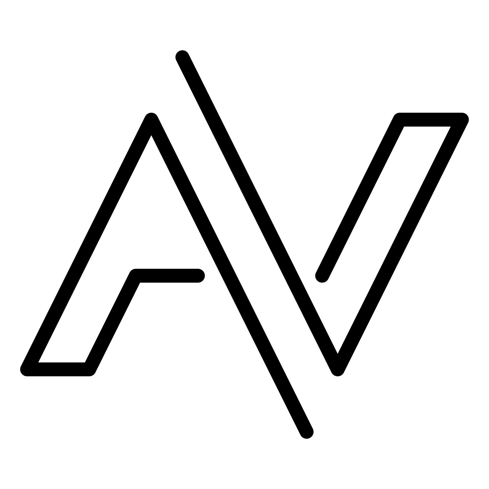

<h1 align="center">Hi there , I'm Aditthya</h1>
<h3 align="center">An Enthusiastic Developer</h3>

  

<!-- ======================= -->
<!-- Profile Views & Followers -->
<!-- ======================= -->

  

    
    
  

  
  <!-- Typing Animation -->
  

<!-- ======================= -->
<!-- GitHub Analytics Header -->
<!-- ======================= -->

<h2 align="center">
  
  GITHUB ANALYTICS
</h2>

<!-- ======================= -->
<!-- GitHub Streak Stats -->
<!-- ======================= -->

  

<!-- ======================= -->
<!-- GitHub Stats -->
<!-- ======================= -->

  
   
  

<!-- ======================= -->
<!-- GitHub Contribution Graph -->
<!-- ======================= -->

  

<!-- ======================= -->
<!-- Connect With Me -->
<!-- ======================= -->
<h2 align="center">
  
  CONNECT WITH ME
</h2>

  
  
  &nbsp;
  
  &nbsp;
  
  &nbsp;
  
  &nbsp;
  
  &nbsp;
  
  &nbsp;
  

 
